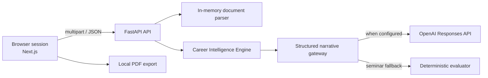

# ANIRA MVP Architecture

This document is the source of truth for implementation decisions. Product changes that conflict with it require explicit approval.

## Product boundary

ANIRA is a stateless career-readiness workflow. It accepts a resume in memory, gathers answers in the current browser tab, generates a report, and allows the learner to download it. Closing or resetting the tab destroys the browser state. The API does not write user content to disk or a database.

Out of scope: authentication, accounts, payments, dashboards, analytics, notifications, email, persistent history, CRM, and admin tooling.

## System



The browser owns workflow state. The API is request-scoped and returns structured JSON. No endpoint creates a server-side session.

## Repository

```text
frontend/               Next.js application
  src/app/              routes and global styles
  src/components/       shared visual components
  src/features/         workflow features and state
  src/lib/              API client and utilities
  src/types/            public frontend types
backend/
  app/api/              HTTP routes
  app/core/             settings and cross-cutting concerns
  app/features/         parsing, evaluation, report services
  app/schemas/          Pydantic API contracts
  prompts/              one Markdown prompt per AI responsibility
  tests/                API and service tests
docs/                   operator and dependency documentation
```

## Naming conventions

- TypeScript components and types: `PascalCase`; functions and variables: `camelCase`.
- Python classes and Pydantic models: `PascalCase`; modules and functions: `snake_case`.
- API routes are nouns under `/api/v1`.
- Prompts use `<responsibility>-agent.md`.
- Scores are integers from 0 to 100.

## Public API contracts

### `GET /api/v1/health`

Returns API status, active mode (`demo` or `ai`), and version.

### `POST /api/v1/resumes/analyze`

Multipart field `file`; accepts PDF, DOCX, or TXT up to the configured size. Returns extracted text summary, detected skills, section coverage, and ATS score. File bytes remain request-scoped.

### `POST /api/v1/career-intelligence/analyze`

Accepts the complete browser evidence payload. Runs the five evaluation agents, resolves conflicting signals, and returns agent evidence plus the ranked Career Intelligence decision record.

### `POST /api/v1/reports/generate`

Accepts the same evidence payload and returns a `CareerReport`. It always runs the deterministic Career Intelligence Engine first. AI mode may enrich only the headline and executive summary through a structured-output gateway.

## AI service interaction

The conceptual agents are narrow prompt/schema services:

1. Resume, ATS, assessment, interview, and skill-gap agents return typed evidence packets.
2. The Career Intelligence Engine resolves shared dimensions and preserves material conflicts.
3. The Career Recommendation Agent ranks six roles only after synthesis.
4. Roadmap and Report agents create evidence-backed actions and the Career Intelligence Report.
5. The optional OpenAI service enriches narrative without permission to change engine facts.

The engine is a typed, request-scoped orchestrator rather than a hidden chain of prompts. LangGraph remains deferred until runtime branching, retries, or human-in-the-loop checkpoints make a graph materially useful. See `docs/CAREER_INTELLIGENCE_ENGINE.md` for weights and conflict rules.

The browser offers progressive-enhancement voice capture through the Web Speech API. It requests microphone permission at action time, uses an in-memory Web Audio analyser for voice-activity indication, stops all media tracks when recording pauses or ends, stores transcript text only in React session state, and always retains a typed-answer fallback.

## Security and privacy

- Validate file type, extension, and size.
- Parse uploads in memory and never log resume text or answers.
- Allow only configured frontend origins.
- Keep the OpenAI key server-side.
- Limit request body and extracted-text sizes.
- Show the learner that AI scores are guidance, not hiring decisions.
- Reset clears browser state; the report download is generated locally.

## Future seams

API clients, evaluation services, and report schemas are interfaces that can later gain authenticated persistence. Future storage must be added behind services; it must not leak into feature components.
