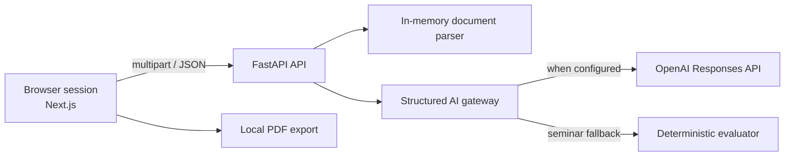

# ANIRA MVP Architecture

This document is the source of truth for implementation decisions. Product changes that conflict with it require explicit approval.

## Product boundary

ANIRA is a stateless career-readiness workflow. It accepts a resume in memory, gathers answers in the current browser tab, generates a report, and allows the learner to download it. Closing or resetting the tab destroys the browser state. The API does not write user content to disk or a database.

Out of scope: authentication, accounts, payments, dashboards, analytics, notifications, email, persistent history, CRM, and admin tooling.

## System



The browser owns workflow state. The API is request-scoped and returns structured JSON. No endpoint creates a server-side session.

## Repository

```text
frontend/               Next.js application
  src/app/              routes and global styles
  src/components/       shared visual components
  src/features/         workflow features and state
  src/lib/              API client and utilities
  src/types/            public frontend types
backend/
  app/api/              HTTP routes
  app/core/             settings and cross-cutting concerns
  app/features/         parsing, evaluation, report services
  app/schemas/          Pydantic API contracts
  prompts/              one Markdown prompt per AI responsibility
  tests/                API and service tests
docs/                   operator and dependency documentation
```

## Naming conventions

- TypeScript components and types: `PascalCase`; functions and variables: `camelCase`.
- Python classes and Pydantic models: `PascalCase`; modules and functions: `snake_case`.
- API routes are nouns under `/api/v1`.
- Prompts use `<responsibility>-agent.md`.
- Scores are integers from 0 to 100.

## Public API contracts

### `GET /api/v1/health`

Returns API status, active mode (`demo` or `ai`), and version.

### `POST /api/v1/resumes/analyze`

Multipart field `file`; accepts PDF, DOCX, or TXT up to the configured size. Returns extracted text summary, detected skills, section coverage, and ATS score. File bytes remain request-scoped.

### `POST /api/v1/reports/generate`

Accepts the complete browser workflow payload and returns a `CareerReport`. AI mode uses a structured-output gateway; demo mode uses the same schema and a deterministic evaluator.

## AI service interaction

The conceptual agents are narrow prompt/schema services:

1. Resume and ATS services convert extracted text into evidence.
2. Interview and assessment evaluators score submitted answers.
3. Career and skill-gap services rank role fit and missing capabilities.
4. Roadmap and report services synthesize the final plan.

For the MVP, one report orchestration request may combine compatible evaluation steps to reduce latency and cost. Prompts remain separate and structured schemas remain stable. LangGraph is deferred until branching, retries, or human-in-the-loop state makes a graph materially useful.

## Security and privacy

- Validate file type, extension, and size.
- Parse uploads in memory and never log resume text or answers.
- Allow only configured frontend origins.
- Keep the OpenAI key server-side.
- Limit request body and extracted-text sizes.
- Show the learner that AI scores are guidance, not hiring decisions.
- Reset clears browser state; the report download is generated locally.

## Future seams

API clients, evaluation services, and report schemas are interfaces that can later gain authenticated persistence. Future storage must be added behind services; it must not leak into feature components.

