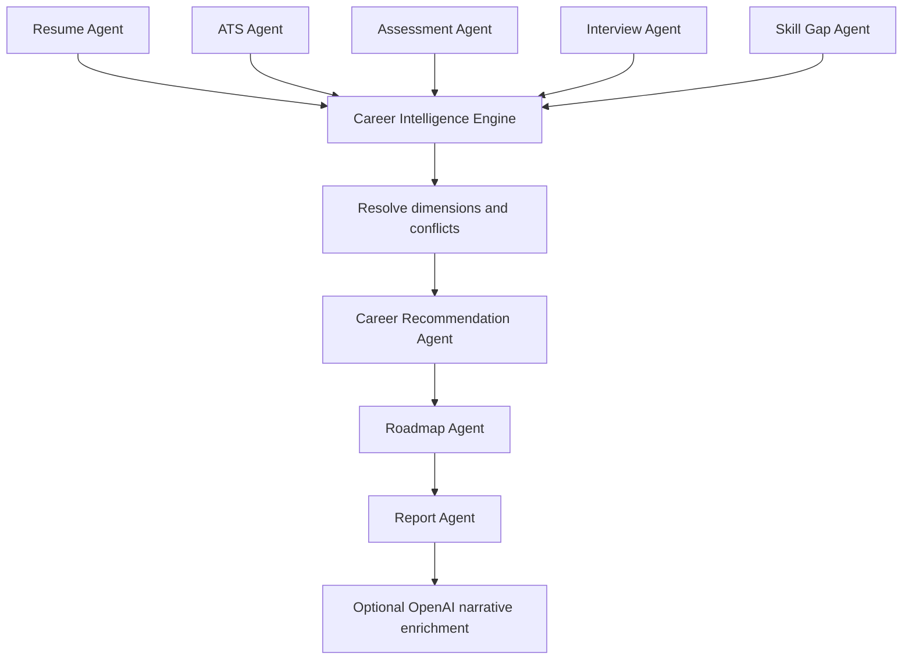

# Career Intelligence Engine

The Career Intelligence Engine is the evidence boundary between ANIRA's evaluation agents and its career recommendation, roadmap, and report agents.

## Invariant

No career is ranked until resume, ATS, assessment, interview, and skill-gap signals have been collected. A career aspiration may influence a close result, but it cannot replace demonstrated evidence.

## Flow

OpenAI narrative enrichment can rewrite only the report headline and executive summary. Engine scores, rankings, confidence, evidence, conflicts, gaps, and roadmap actions are immutable.

## Agent contract

Every upstream agent returns:

- `agent`: stable source name;
- `summary`: concise interpretation;
- `dimensions`: scored capabilities with per-dimension confidence;
- `strengths` and `concerns`;
- `evidence`: source, claim, observation, strength, and reliability.

This makes missing evidence distinguishable from weak evidence and allows the engine to explain its result.

The request contract rejects synthesis until all five objective items, both descriptive answers, and all three interview answers contain enough evidence. This enforces the workflow even if a caller bypasses the browser UI.

## Dimensions

The MVP uses:

- technical analysis;
- quantitative reasoning;
- communication;
- problem solving;
- stakeholder management;
- execution;
- learning agility;
- STAR method;
- clarity, vocabulary, sentence structure, and professionalism;
- leadership, critical thinking, role understanding, and domain knowledge;
- resume quality;
- role skill coverage.

Listening and vocal confidence are returned as low-confidence neutral signals when only text transcription is available. ANIRA does not pretend to infer acoustic qualities from words alone.

## Evidence weights

| Agent | Readiness weight |
| --- | ---: |
| Resume Agent | 20% |
| ATS Agent | 15% |
| Assessment Agent | 25% |
| Interview Agent | 25% |
| Skill Gap Agent | 15% |

Dimension resolution uses the confidence attached to each signal, not the readiness weights above. Direct assessment evidence generally receives higher confidence than a keyword inferred from a resume.

## Conflict resolution

A conflict is recorded when two sources score the same dimension at least 22 points apart. The engine:

1. preserves both source scores;
2. computes a confidence-weighted resolution;
3. lowers overall recommendation confidence;
4. returns the resolution and rationale in the report.

Conflicts are not errors. A student can describe a capability poorly on a resume but demonstrate it strongly in an assessment.

## Career ranking

Six role profiles declare dimension weights and required skills. The Career Recommendation Agent combines:

- 82% resolved capability dimensions;
- 18% demonstrated required-skill coverage;
- a maximum 7-point aspiration bonus when the learner explicitly names a matching path.

The aspiration bonus breaks close ties without allowing preference to overwhelm evidence.

The response includes:

- top career match;
- five alternatives;
- recommendation confidence;
- supporting evidence;
- role-specific gaps;
- why every alternative ranked lower;
- indicative market context and learning timeline.
- interview, hiring, and industry readiness estimates.

Salary context is illustrative for an India-based seminar audience, not a compensation promise. It must be checked against current local vacancies before production use.

## Deterministic seminar mode

The full evidence pipeline runs without an OpenAI key. This is the authoritative fallback and is tested in CI. When OpenAI is enabled, the app uses the Responses API with a Pydantic structured-output schema for narrative enrichment only. The configured `gpt-5.4-mini` supports the Responses API and Structured Outputs.
